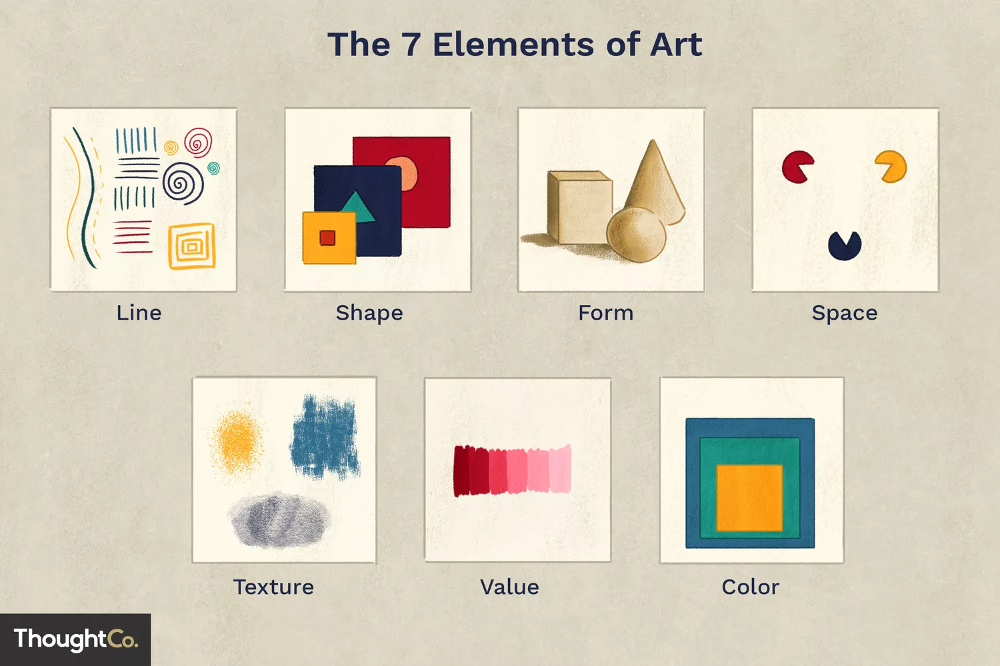
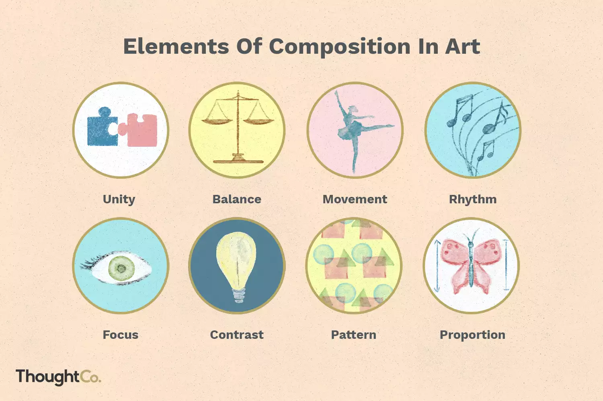

# Arte

## Purpose of Art

### Non-motivated functions

- Basic human instinct for harmony, balance, rhythm (internal appreciation of beauty)
- Experience of the mysterious
- Expression of the imagination
- Ritualistic and symbolic functions

### Motivated functions

- Communication
- Art as entertainment
- The Avant-Garde. Art for political change
- Art as a "free zone"
- Art for social inquiry, subversion or anarchy
- Art for social causes
- Art for psychological and healing purposes
- Art for propaganda, or commercialism
- Art as a fitness indicator

## Elements of Art

### Line

* *Garabatos* moviéndose en el espacio entre dos puntos
* Movimiento, dirección e intención de acuerdo a la orientación del trazo
* Describe un contorno capaz de describir texturas
* Tipos:
    * Reales (descriptive) - Implícitas - (Abstracta)
    * Verticales - Horizontales - Diagonales
    * De contorno
* Pueden tener diferentes funciones
* Pueden expresar flexibilidad, rigidez, naturaleza sintética o vida
- Length and shape: Short, long, curved, straight, zig-zag, thin, thick
- Movimiento, ritmo o énfasis

### Shape

* Diseño 2d limitado por líneas
* Puede tener diferentes valores de color para parecer tridimensional
* Tipos:
    * Geométricos
    * Orgánicos
* Expresan diferentes sensaciones o simbolismos (peligro, síntesis, estructura, caos o adaptabilidad)

### Form

- Objeto tridimensional con volumen
- En disciplinas más físicas: escultura o modelado 3d
- Geométricos y orgánicos
- Shading and Outlines

### Color

- Propiedades:
    - Hue
    - Chroma or intensity/saturation: brightness
    - Value
- Cuando la luz refleja en los objetos y alcanza el nervio óptico
- Rueda del color, color schemes
- Primarios, secundarios, terciarios, complementarios, análogos
- Hue, tint, tone and shades
- Color temperature: cool, warm
- Evoca fuertes respuestas emocionales
- Wavelenghts (electromagnetic radiation)
    - Violet
    - Indigo
    - Blue
    - Green
    - Yellow
    - Orange
    - Red

### Space (positive and negative)

- Perspectiva: distancia entre y alrededor
- Proporción: entre formas u objetos y la percepción de su relación con el primer plano y el fondo (foreground and background)
- Espacio positivo: con un tema
- Espacio negativo: sin un tema
- Open and Closed spaces: empty and physical elements (sculpture)
- Linear and atmospheric perspective

### Texture

- Calidad de la superficie de la obra
- Puede ser:
    - Táctil (real)
    - Estrictamente visual (implícita)
    - Creado (Van gogh)
- Tipos de superficies...

### Value

* Luminosidad
* Grados o tonos de claridad
* Contraste: diferencia entre el más claro y el más oscuro tono, con los infinitos grises en medio
* Puede ser en grises o en color
- Clave alta, media y baja

### Mark making and materiality

* Interacción entre el artista y los materiales que usa
* Elección del material y como impacta en la obra y como el espectador lo percibe

## Principles of Art, Design and Organization

### Unidad o armonía (*Unity or Harmony*)

Uso similar o uniforme de elementos o aspectos que unifiquen o unan una composición.

### Variedad (*Variety*)

Uso diverso de un elemento o aspecto: colores, formas, líneas, texturas, etc.

### Equilibrio (*Balance*)

Distribución del peso visual. Los elementos pueden equilibrarse o no a lo largo de un eje visual de forma:

- Simétrica (*Symmetrical*)
- Asimétrica (*Asymmetrical*)
- Radial

Las cantidades comparativas de elementos (color, texturas, formas, etc) pueden crear una sensación de equilibrio dentro de una composición.

### Énfasis o Punto focal (*Emphasis or Focus*)

Se refiere a lo que atrapa más al ojo del espectador en la obra o a la parte más importante. Puede ser:

- Un solo punto focal
- Un orden claro de énfasis
- Múltiples puntos focales

### Contraste (*Contrast*)

Es alcanzado cuando existen diferencias chocantes en aspectos o elementos en una obra.

### Ritmo/Repetición/Patrón (*Rhythm/Repetition/Pattern*)

Se refiere al uso repetido de determinados elementos para crear un patrón o área de interés visual. El ritmo muchas veces crea una sensación de movimiento y la relación de las partes al todo.

### Movimiento (*Movement*)

Uso de los elementos para liderar el ojo del espectador en una manera particular, para crear la sensación de movimiento (movimiento visual), movimiento real, o crear ritmo.

### Proporción (*Proportion*)

Se refiere al tamaño específico de cada elemento y cómo se relaciona con el tamaño de los otros elementos de la obra.

### Otros

- **Escala** (*Scale*)
- **Progresión** (*Gradation*)

## Fuentes

* https://en.wikipedia.org/wiki/Art
* https://en.wikipedia.org/wiki/Elements_of_art
* https://artincontext.org/elements-of-art/
